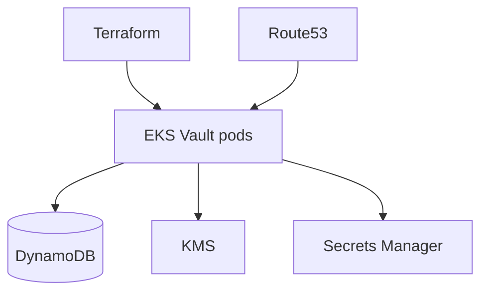

# Presentación — Vault HA en EKS (DynamoDB storage)

Material listo para publicar en **LinkedIn** (post + carrusel). Copiá cada sección como una diapositiva o bloque del post.

**Speech listo para copiar/pegar:** [speech-linkedin.md](speech-linkedin.md)

---

## Slide 1 — Hook

### Vault en EKS sin el dolor de armar HA a mano

Presento **Vault HA en EKS (DynamoDB storage)**: HashiCorp Vault en alta disponibilidad sobre EKS, storage DynamoDB, TLS y DNS — con Terraform

Terraform · EKS · Vault · DynamoDB · KMS · Route53

---

## Slide 2 — El dolor

- Storage, KMS y roles IRSA sueltos
- Certificados y DNS olvidados
- Cada entorno se configura distinto

**Automatizar esto no es lujo — es repetibilidad.**

---

## Slide 3 — Qué hace

---

## Slide 4 — Características

- **HA**: Vault en EKS con storage DynamoDB
- **KMS**: Cifrado y unseal preparado para AWS
- **IRSA / roles**: Permisos IAM alineados al cluster
- **DNS + TLS**: Route53 y certificados ACM/certs
- **IaC**: Despliegue reproducible con Terraform

---

## Slide 5 — Cómo probarlo

1. Cloná el repo
2. Copiá `terraform.tfvars.example` → `terraform.tfvars`
3. `terraform init && plan && apply`
4. Revisá outputs / recursos en la consola AWS

Repo: `https://github.com/ghcetraro/terraform_aws_eks_vault`

---

## Slide 6 — CTA

Open source · MIT · listo para adaptar a tu cuenta.

⭐ Si te sirve, estrella en GitHub y compartí feedback.

`https://github.com/ghcetraro/terraform_aws_eks_vault`
